# Biz Mate (+ Sea Codex VN prep)

Monorepo public: **Biz Mate** (agent viết workflow nghiệp vụ deterministic) + **ba ứng viên hackathon VN** rút từ nghiên cứu SEAC + ý Evoloop / propose→verify→decide.

## Pillars

| App | Ý tưởng | Hướng |
|-----|---------|-------|
| `apps/mate` + `judge` + `em` + `runtime` + `web` | **Biz Mate** — agent codegen workflow (sales/accounting), Laya+SLM judge, AI EM | AI-Native Ops |
| `apps/bookkeeper` | **Kế toán AI tiểu thương** — voice/sổ → sổ cái + ngưỡng 1 tỷ + citation | Deep Domain |
| `apps/shield` | **Tấm khiên số** — chặn scam/deepfake cho người già + alert gia đình | Autonomous |
| `apps/floodops` | **Logistics mùa mưa** — replan đơn khi ngập, escalate hoàn tiền | Autonomous |

## Screenshots

#### BizMate

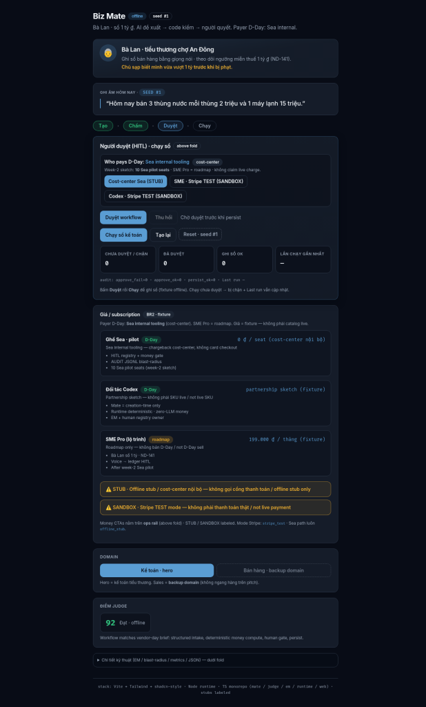
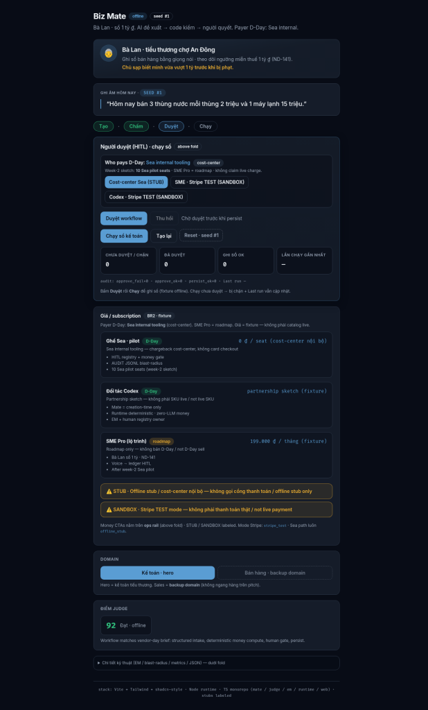
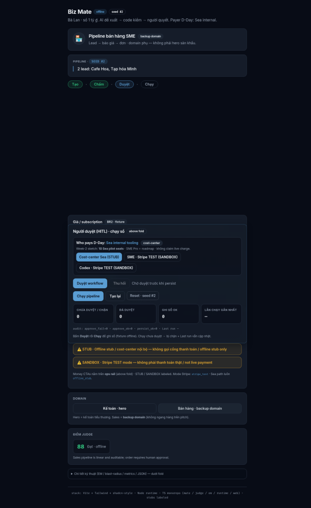

#### Shield

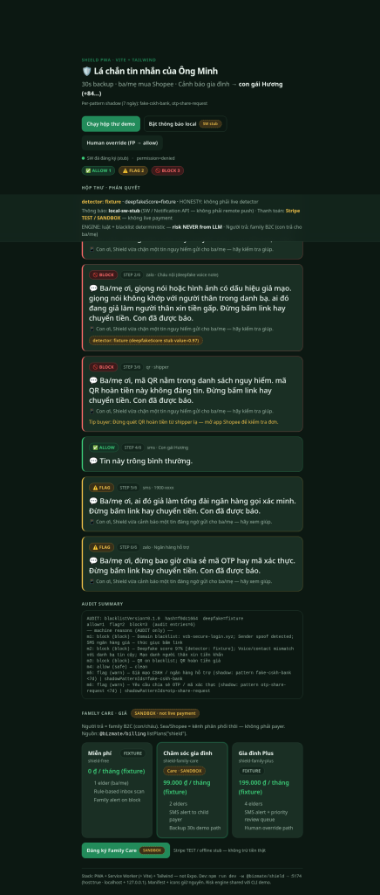

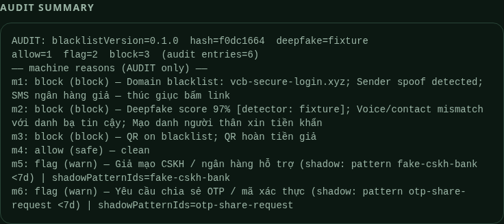
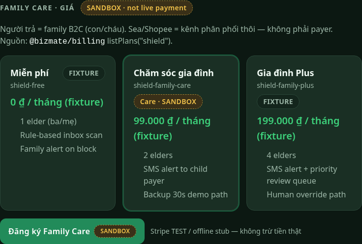

#### Bookkeeper

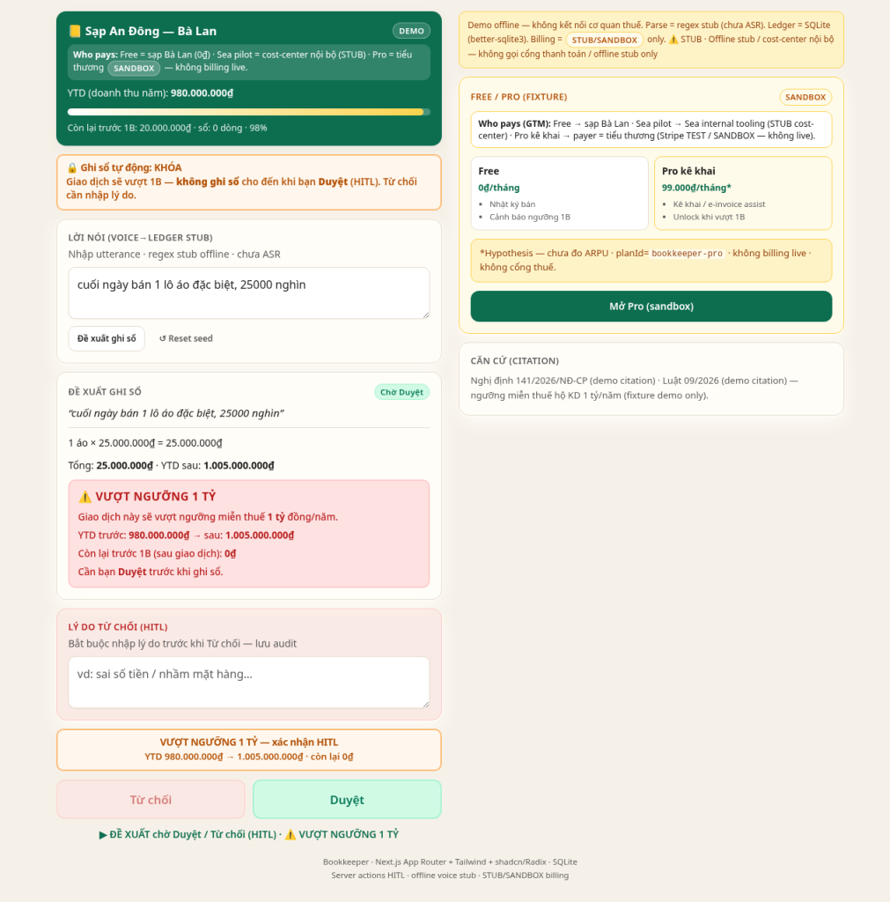

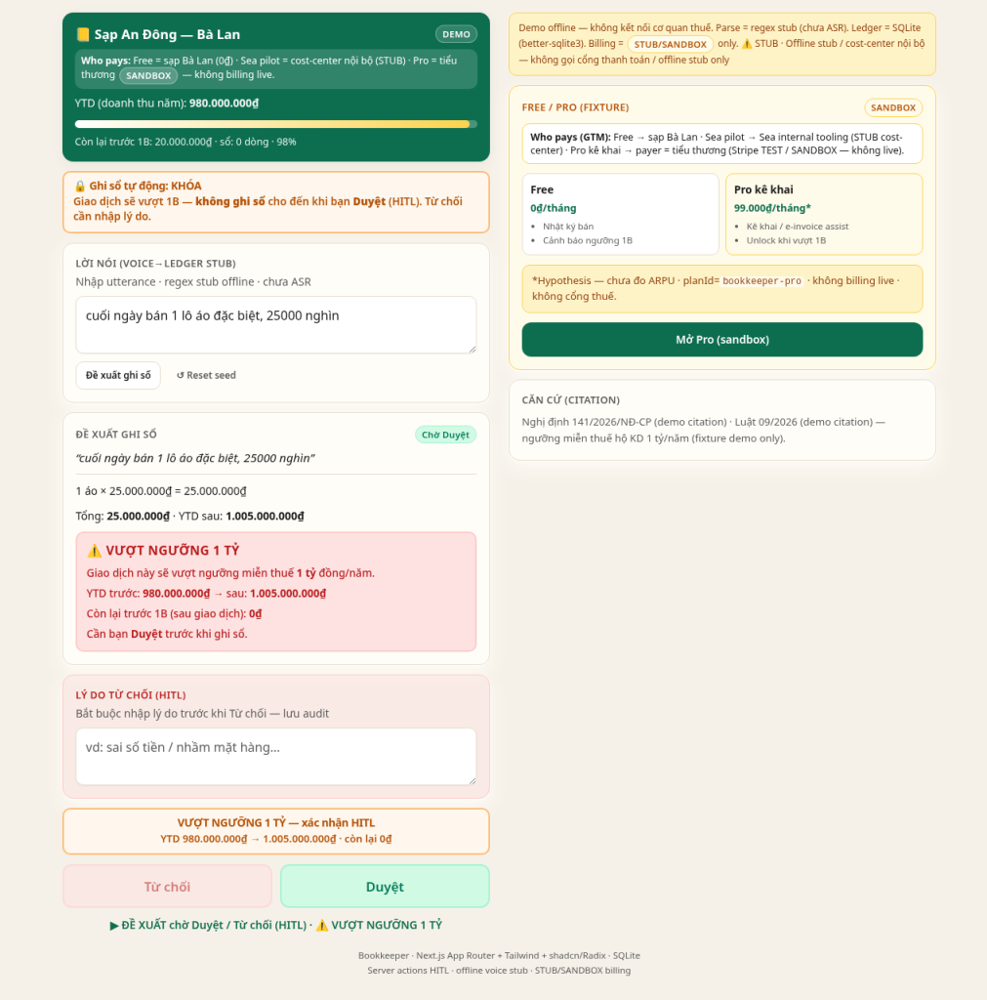
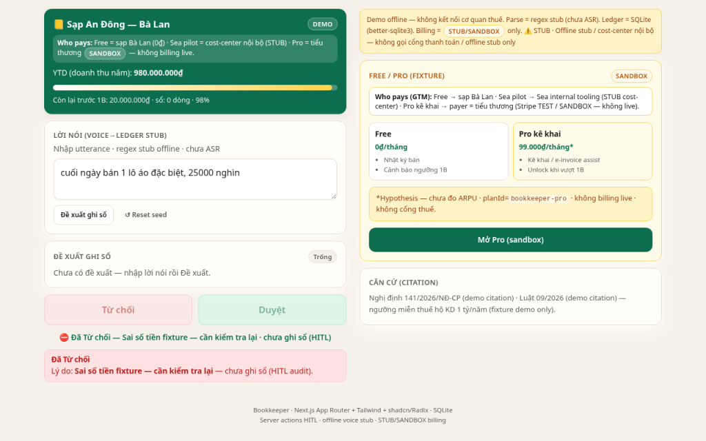
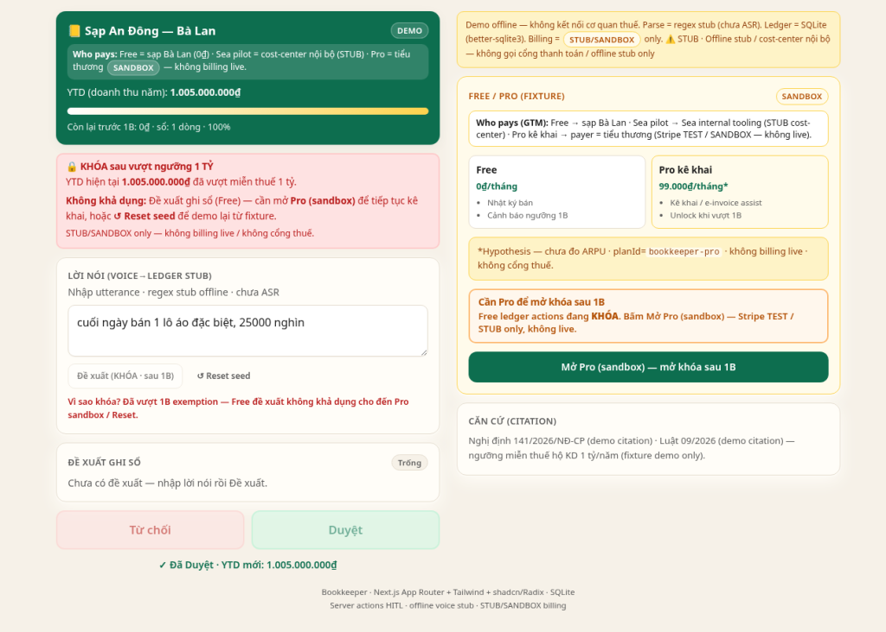

#### FloodOps

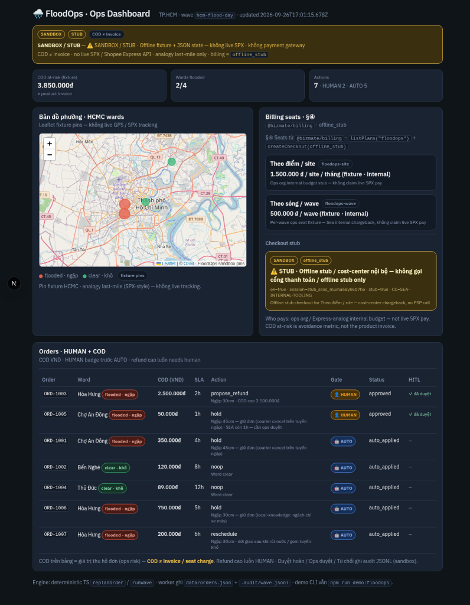
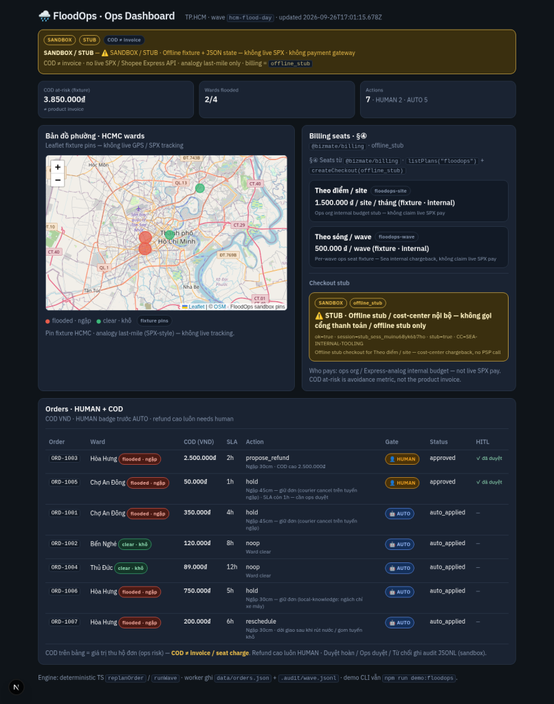

Research nguồn: `docs/research/seac/` (Sea x OpenAI Codex Hackathon SG/TW/VN).

## Nguyên tắc chung

```
AI proposes → code verifies → human decides
Offline deterministic demo luôn chạy được (không API key)
```

## Quick start

```bash
npm install
npm run validate:contracts
npm test
npm run demo:offline          # Biz Mate runtime
npm run demo:bookkeeper       # kế toán tiểu thương
npm run demo:shield           # chống scam
npm run demo:floodops         # logistics ngập
npm run dev:web
```

## Docs

- `docs/product/` — vision, architecture, barem→tech
- `docs/hackathon/` — PRD templates, pitch, D-Day runbook
- `docs/research/seac/` — toàn bộ research zip
- `AGENTS.md` — hiến pháp cho coding agents

## License

MIT.
